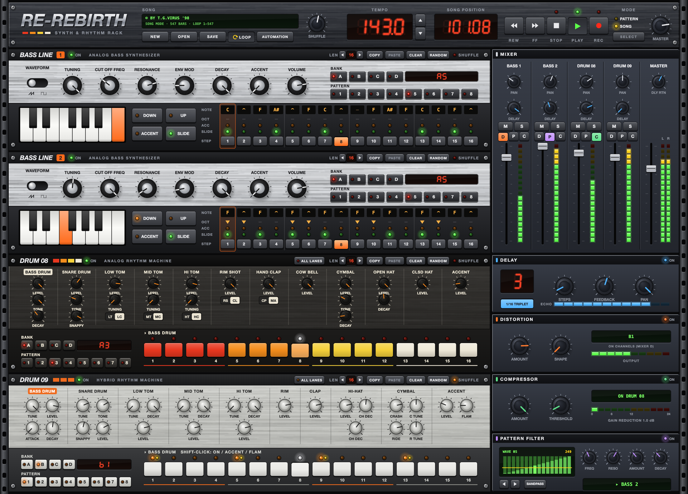

# Re-Rebirth

A tribute to [ReBirth RB-338](https://en.wikipedia.org/wiki/ReBirth_RB-338) in the browser: two acid bass lines, two drum machines, a mixer with effects, and a pattern/song sequencer. It opens original ReBirth 2.0 songs (`.rbs`) and plays them back.

Everything is drawn on a canvas and every sound is synthesized live with the Web Audio API: no samples.



**Try it:** [rb.ol3h.org](https://rb.ol3h.org). Click the logo and choose **Load TGV's KiloMix '98** for an example song, then press <kbd>Space</kbd>.

## Features

- **Bass Line 1 & 2:** monophonic acid synths with saw/square waveform, tuning, cutoff, resonance, envelope mod, decay and accent. Per-step notes, octave, accent and slide.
- **Drum 08:** analog-style rhythm machine. The LT/LC, MT/MC, HT/HC, RS/CL and CP/MA switches select congas, claves and maracas.
- **Drum 09:** hybrid rhythm machine with per-step accent and flam.
- **ALL LANES grid** on both drum machines: see and paint every instrument of a pattern at once.
- **Mixer:** level, pan, delay send, mute/solo and distortion / pattern filter / compressor routing per channel, with meters.
- **Effects:** tempo-synced delay, distortion, compressor and a pattern-controlled filter.
- **Sequencer:** 32 patterns per device (banks A–D), length and shuffle per pattern, copy/paste/clear/random.
- **Song mode:** play a song's arrangement and automation, loop a range, or arm REC and record pattern changes and knob moves.
- **Automation window:** every recorded control of the song as a graph over time. Pan, zoom, and click the ruler to jump.
- **Songs:** opens ReBirth 2.0 / 2.0.1 `.rbs` files and saves its own `.json`. Work is autosaved in the browser.
- The rack scales to fill the window. It works with a mouse, a trackpad or touch, including iPad and iPhone.

### Keys and gestures

| | |
|---|---|
| <kbd>Space</kbd> | Play / stop (stop twice to rewind) |
| Drop a `.rbs` / `.json` file | Open it |
| Drag a knob up/down, or scroll | Turn it; hold <kbd>Shift</kbd> for fine steps, double-click to reset |
| Hold REW / FF | Seek, faster the longer you hold |
| Shift-click a Drum 09 step | Cycle on → accent → flam → off |
| <kbd>Esc</kbd> | Close a window |

## Song compatibility

Re-Rebirth reads songs made with ReBirth 2.0 and 2.0.1 that use the standard sounds. Songs made for a ReBirth *mod* (custom samples and graphics) are refused, since their sounds can't be reproduced. Many songs are in the [nordbeat ReBirth archive](https://nordbeat.com/archive/rebirth/song_archives.htm).

The file reader follows Propellerhead's format description ([`docs/RBS42.txt`](docs/RBS42.txt)). Where real files disagree with the description, the files win; those places are noted in [`src/song/rbs.js`](src/song/rbs.js).

## How close does it sound?

The voices and effects are synthesized from scratch. Their settings were fitted by measuring ReBirth's own renders: full songs, per-channel exports and a test song that plays every drum sound in isolation. Only levels, pitch, decay and spectra were measured; no audio from ReBirth is included or used in the app.

## Development

Tool versions are pinned with [mise](https://mise.jdx.dev) in `mise.toml`: Node for the app, Python for the calibration scripts and Ruby for Kamal. Run `mise install` once.

```sh
npm install
npm run dev      # local dev server
npm run build    # static site in dist/
```

The app is plain JavaScript with no framework, built with Vite:

| Path | |
|---|---|
| `src/audio/` | Web Audio engine: bass voice, drum voices, effects, mixer |
| `src/render/` | Canvas rack: devices, controls, About and automation windows |
| `src/sequencer/` | Lookahead clock and pattern scheduling |
| `src/song/` | Song model, playback/recording, `.rbs` reader, `.json` sessions |
| `src/ui/` | Pointer handling and hit regions |
| `tools/` | Offline rendering and analysis scripts used for calibration |

### Calibration tools

`npm run render` renders a song offline with the real engine in headless Chrome. It uses the locally installed Chrome; set `CHROME=/path/to/chrome` to override.

```sh
npm run render -- "tracks/song.rbs" out.wav --start 1 --bars 16 --rate 44100 [--solo r909] [--set fx.dist.on=0] [--no-trim]
```

The Python scripts in `tools/` compare such renders against reference recordings per bar, step, band and isolated hit. They need [uv](https://docs.astral.sh/uv/):

```sh
uv run --with numpy --with scipy python tools/steps.py score reference.wav --bpm 143 --ref-bar1 0.004 out.wav:1:1:8
```

## Deployment

The site is static: a Vite build served by nginx (`Dockerfile`, `config/nginx.conf`). It's deployed with [Kamal](https://kamal-deploy.org) (`config/deploy.yml`), which ships the image through Kamal's local registry:

```sh
kamal deploy
```

## Credits

- Made by Oleh Khomei, 2026. See [`CHANGELOG.md`](CHANGELOG.md) for what changed between versions.
- A tribute to ReBirth RB-338 by Propellerhead Software (1997). This is an independent project, not affiliated with or endorsed by Reason Studios. ReBirth is a trademark of its owner.
- The RBS format description is © 1998 Propellerhead Software AB and is included unmodified, as its terms require.
- Example song: *TGV's KiloMix '98* by T.G.ViRUS, written for ReBirth 2.0.
